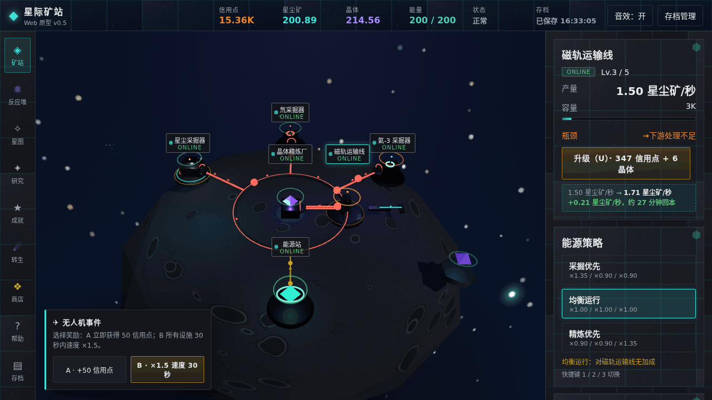
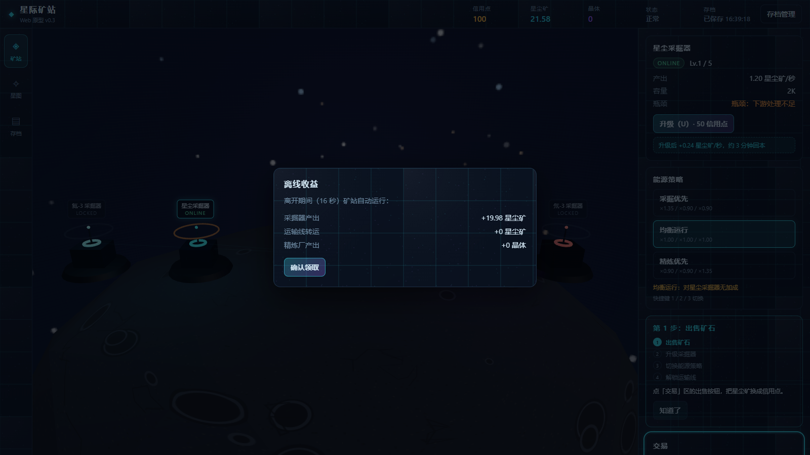

# 星际矿站 · Star Miner

[](https://github.com/shunshun0712/star-miner-web/actions)


> **v0.5.0** ｜ 💻 **仅桌面端浏览器**（手机/平板未适配）｜ 🔊 有音效、无 BGM（顶栏按钮可关）

一款原创科幻放置经营游戏，浏览器打开即玩。在 Aurora-1 星球上修复采掘器、运输线与精炼厂，把一座废弃矿站重建为自给自足的星际工业枢纽。

**和别的放置游戏有什么不同**

- 🖥️ **纯前端单机**：无后端、无账号、无内购，存档只存在你自己的浏览器里
- 🎨 **零美术资源**：游戏内纹理全部程序化生成，不依赖外部美术素材
- 🌐 **能看的 3D 矿站**：Three.js 实时渲染矿站场景与反应堆粒子流，不是纯文字表格



*核心生产循环，挂着也在变强*

## 目录

**玩家**

- [游戏目标](#游戏目标)
- [新手指南](#新手指南)
- [特性](#特性)
- [操作说明](#操作说明)
- [三大成长系统](#三大成长系统)
- [存档与备份](#存档与备份)
- [内容量与时长预期](#内容量与时长预期)
- [常见问题（FAQ）](#常见问题faq)
- [已知问题](#已知问题)
- [交流与反馈](#交流与反馈)

**开发者**

- [环境要求](#环境要求)
- [快速开始](#快速开始)
- [技术栈](#技术栈)
- [项目结构](#项目结构)
- [测试](#测试)
- [设计文档](#设计文档)
- [贡献](#贡献)
- [路线图](#路线图)

## 在线体验

> ▶ 免安装、免登录，浏览器打开即玩（GitHub Pages 托管静态单文件版）。

| 入口 | 状态 |
|------|------|
| ▶ 在线 Demo（GitHub Pages） | ✅ [https://shunshun0712.github.io/star-miner-web/demo/](https://shunshun0712.github.io/star-miner-web/demo/) |

## 截图



*v0.5.0 主界面：左侧设施导航，中央 3D 矿站场景*

## 游戏目标

核心循环一句话：

**生产资源 → 升级设施 → 研究科技 → 转生 → 带着永久加成更强地重来**

「转生」是放置游戏的经典机制：重置当前所有进度，换取永久货币「星核」，让下一局发展更快——就像 New Game+，打完一周目继承强力 buff 开二周目。没有"通关"概念，每一轮都比上一轮更强。

## 新手指南

### 第 1 分钟：升级 + 卖矿

开局你有 100 信用点和一台 1 级星尘采掘器（自动产星尘，1.2/秒）。只需记住两件事：

1. 选中采掘器，按 `U` 升级（首次 50 信用点）——产能立即提升
2. 星尘堆在仓库里，**手动卖星尘换信用点**（1 星尘 = 1 信用点），用钱继续升级

> 嫌手动卖矿麻烦：自动售卖开关在「矿站」面板内（本作无独立设置面板）。

### 第 5 分钟：认识随机事件

约 2 分钟后触发第一个随机事件，之后每 3–5 分钟一次，均有弹窗提示：

- **无人机**（最常见）：A/B 二选一——选 A 直接 +50 信用点；选 B 获得 30 秒全设施 ×1.5 加速。缺钱选 A，想冲产量选 B
- **太阳风暴**（负面）：60 秒全设施减产（均衡策略 −10%，其它 −20%）。无需操作，等它过去即可
- **投入型**（每局仅一次）：花 200 信用点换采掘器永久 +5%。前期信用点紧张可先忽略

### 中后期指引：解锁顺序与转生时机

**设施解锁顺序**（按成本从低到高）：磁轨运输线（600 信用点，第 1 个里程碑）→ 晶体精炼厂（1000）→ 能源站（1000 + 15 晶体）→ 氦-3 采掘器（1250 + 20 晶体）→ 研究中心（50 晶体）→ 氘采掘器（3000 + 100 晶体）。

**节奏预期**：约 7-8 分钟解锁运输线；精炼厂产出晶体后信用点获取加速；开局没有能源站、设施不耗电，能量问题解锁能源站后再考虑。面板随进度逐个解锁，不用刻意追赶。

**什么时候转生**：通常需要先解锁研究中心、研究若干 T1–T2 科技并积累可观的晶体/同位素储量——大致在主动游玩数小时量级。打开转生面板即可看到**预估星核数与分项明细**（不必确认转生），数值满意了再转。支持离线收益（上限 8 小时），挂着也在变强。

## 特性

- **生产链**：星尘采掘器 → 氦-3 采掘器 → 氘采掘器 → 磁轨运输线 → 晶体精炼厂，同位素/反物质/暗物质为后期高级资源
- **策略**：三档能源策略（采掘优先 / 均衡运行 / 精炼优先）+ 能源储备池；三类随机事件
- **成长**：转生系统 + 星核商店（15 种永久加成）+ 30 个成就（每 10 个成就 +1% 全局产量）+ 四分支科技树（T0–T4 共 29 节点，当前开放 T0–T2）
- **工程**：离线收益（8 小时上限）、浏览器本地存档 + JSON 导入导出、节奏数据 CSV 导出、`~` 调试面板（仅 dev 构建）

## 操作说明

### 键盘快捷键

| 按键 | 功能 |
|------|------|
| `1` / `2` / `3` | 切换能源策略（采掘优先 / 均衡运行 / 精炼优先） |
| `U` | 升级或解锁当前选中设施 |
| `M` | 打开存档管理（导出/导入 JSON、导出 CSV） |
| `Esc` | 关闭弹窗 |
| `~` | 打开调试面板（仅 dev 构建） |

> 帮助面板无独立快捷键，点侧边栏「帮助」按钮打开；音效开关在顶栏，点击切换。

### 侧边栏导航

矿站（默认视图）、反应堆、星图、研究、成就、转生、商店、存档、帮助共 9 个面板，随游戏进度逐步解锁——矿站、存档、帮助开局即有，其余正常游玩自然开放。

## 三大成长系统

### 同位素反应堆（中期解锁）

完成「稀有矿同位素开采」研究后解锁（采掘分支 T2，前置链：基础研究 T0 → 矿脉探测 T1 → 稀有矿同位素 T2——中前期内容，不是后期）。同位素有三种用法：

- **限时 Buff**：催化过载（全采掘 ×2，10 分钟）/ 晶体共鸣（精炼 ×1.5，5 分钟）/ 同位素熔炉（全采掘 ×1.5，20 分钟）。多 Buff 乘法叠加，当前最高 ×3.0，系统保护上限 ×8
- **深空探索**：每次限 1 路，消耗同位素换取反物质 / 暗物质，耗时 1–6 分钟，风险递增
- **碎片兑换**：同位素 ↔ 信用点 / 晶体、反物质 → 暗物质，无冷却

### 转生系统

消耗资源获取星核，转生仪式约 4.2 秒（坍缩 → 爆发 → 重生三段动画）。

- **重置**：信用点与所有资源归零，设施等级回 1，研究与成就清空（成就产量加成随之归零）
- **保留**：星核余额、转生等级、转生历史、星核商店购买的永久加成
- **星核多少**：由资源储量、设施等级、研究项数综合计算，转生面板实时显示预估数与明细

### 星核商店

15 种永久加成物品，分五类：经济（信用点加成）、生产（产量加成）、研究（研究折扣）、设施（开采许可与等级突破）、转生（星核增幅）。购买等级跨转生保留，成本随等级递增，部分物品有前置依赖链。

## 存档与备份

存档只保存在你的浏览器本地（IndexedDB），**清除浏览器数据或换设备会丢存档**。

- **怎么备**：按 `M` 打开存档管理 → 导出 JSON，文件默认进浏览器下载目录
- **备多久一次**：建议每次转生前、每次有较大进展后各导一次，几秒钟的事
- **换设备怎么办**：新设备打开游戏 → 存档管理 → 导入之前的 JSON 即可
- **云同步**：暂无计划，想要的话到 [Issues](https://github.com/shunshun0712/star-miner-web/issues) 投票

旧版存档升级到新版**不会丢**：游戏内置自动迁移，导入或加载旧存档时自动升级，缺失字段回填默认值。建议更新版本前顺手导出一份备份以防万一。

## 内容量与时长预期

当前版本内容：6 种设施、29 个科技节点（T0–T2 可研究，T3/T4 后续版本开放）、30 个成就、15 种商店物品、3 条深空探索路线。

- **上手**：5 分钟理解核心循环
- **首次转生**：主动游玩数小时量级（离线收益可辅助积累）
- **全成就 + 商店满级**：需多次转生循环，时长因玩法节奏而异——放置游戏的设计就是长线经营

## 常见问题（FAQ）

**游戏卡住或画面异常？**
直接刷新页面即可。存档在浏览器本地，刷新不丢。

**想彻底重新开始？**
游戏内用「转生」重置并保留永久加成；如需完全清档（无游戏内重置按钮）：Chrome 点地址栏左侧锁/信息图标 → 站点设置 → 清除数据；或按 `F12` → Application → 删除 IndexedDB 的 `star-miner` 与 Local Storage 的 `starminer-snapshot`。

**离线收益怎么算？**
按当前产能持续累积，上限 8 小时，回来后自动结算。

**有声音吗？**
有程序化音效（点击 / 升级 / 解锁三种），无 BGM。首次操作后启用，顶栏「音效：开/关」按钮切换。

**手机能玩吗？**
暂不能。当前版本未适配移动端，请用桌面端浏览器。

## 已知问题

- 手机 / 平板布局未适配（见路线图）
- 更多问题追踪见 [GitHub Issues](https://github.com/shunshun0712/star-miner-web/issues)

## 交流与反馈

遇到 Bug、想提建议或讨论玩法，欢迎在 [GitHub Issues](https://github.com/shunshun0712/star-miner-web/issues) 留言（需 GitHub 账号）。暂无玩家社群（QQ 群 / Discord 等），希望开一个的话到 Issues 投票。

---

> **以下为开发者内容**

## 环境要求

- **Node.js 18+，推荐 20 LTS**（Vite 6 支持 18/20/22+；CI 验证环境为 Node 20，与推荐版本一致）
- 桌面端现代浏览器（Chrome / Edge / Firefox 最新版，需支持 WebGL2）
- 含 3D 场景与粒子效果，老旧或集成显卡可能掉帧；**目前无画质调节选项**，掉帧不影响游戏逻辑与存档

## 快速开始

仓库为多目录结构，游戏代码在 `game/` 子目录（根目录无 package.json，需先进 `game/`）：

```bash
git clone https://github.com/shunshun0712/star-miner-web.git
cd star-miner-web/game
npm install
npm run dev        # 开发服务器 http://localhost:5173
```

构建生产版本：

```bash
npm run build      # 含 tsc --noEmit 类型检查
npm run preview    # 预览 http://localhost:4173
```

> ⚠️ **构建产物不在仓库内**：输出到仓库外层的 `../outputs/StarMinerWeb`（与源码分离，便于整体部署）。build 后不要去 `game/dist/` 找；删除仓库目录时产物不受影响；配置 CI/CD 时注意该相对路径。

**Windows 一键启动**：先 `npm run build`，再双击根目录「一键启动.bat」。它会依次检查 Node.js → 安装依赖（首次）→ 构建 → 用自带的 Node 静态服务器（`game/tools/static-server.mjs`）在 **4173 端口**托管产物。**只依赖 Node.js**，无需 Python 或其它工具；关闭窗口即停止服务。

## 技术栈

| 类别 | 技术 | 版本 |
|------|------|------|
| 语言 | TypeScript | 5.8.3 |
| 构建 | Vite | 6.3.5 |
| 渲染 | Three.js | 0.170.0 |
| 测试 | Vitest | 3.2.4 |

运行时依赖仅 three 一个，其余均为开发依赖。版本号以 `game/package.json` 为准。

## 项目结构

```
star-miner-web/
├── game/                    # 游戏源码
│   ├── src/
│   │   ├── core/            # 游戏逻辑（生产/经济/事件/研究/转生/商店等纯函数）
│   │   ├── scene/           # Three.js 3D 场景
│   │   ├── ui/              # 面板与弹窗
│   │   ├── save/            # IndexedDB 存档与导入导出
│   │   ├── input/           # 快捷键
│   │   ├── audio/           # 程序化音效
│   │   └── art/             # 程序化纹理
│   ├── static/              # 静态资源
│   └── tools/               # 静态服务器等工具脚本
├── docs/                    # 设计文档与计划书
├── .github/workflows/       # CI 配置
├── screenshot.png           # 游戏截图
└── 一键启动.bat              # Windows 一键启动
```

## 测试

```bash
cd game
npm test            # 一次性跑全量（Vitest）
npm run test:watch  # 开发态监听
```

测试重点覆盖转生公式、商店事务、反应堆状态机等纯函数。CI 在每次 push 与 PR 时自动执行 `npm run build`（含类型检查）与 `npm test`，构建历史见 [Actions](https://github.com/shunshun0712/star-miner-web/actions)。

## 设计文档

- [WebGL 原型计划书汇总](docs/星际矿站_WebGL原型_计划书汇总.md) — **建议先读**：总体设计与数值
- [v0.4 科技期计划书](docs/星际矿站_v0.4_科技期_计划书.md) — 科技树 / 能源 / 成就设计
- [v0.3 迭代计划书](docs/星际矿站_v0.3_迭代计划书.md) — 早期迭代记录
- [运输与布局优化计划书](docs/星际矿站_运输与布局优化计划书.md) — 运输系统设计
- [同类游戏调研](docs/开源项目调研_同类游戏.md) — 竞品参考

> 各系统的详细设计文档（反应堆事务模型、转生存档分层、商店状态机等）与更新日志（CHANGELOG）整理中，后续补充到 `docs/`。

## 贡献

欢迎 PR！提交前请确保 `npm test` 与 `npm run build`（含类型检查）通过。暂无 lint / format 配置，代码风格参照现有源码；贡献指南（CONTRIBUTING.md）待补充，也欢迎 PR 补全工程化配置。

当前 npm scripts：`dev` / `build` / `preview` / `test` / `test:watch`。

## 路线图

- [x] M2 同位素反应堆
- [x] M3 转生系统
- [x] M4 星核商店
- [ ] 🚧 T3/T4 科技树与数值平衡（节点已定义、资源 schema 已注册，待填充数值，下一版本推进）
- [x] 在线 Demo 部署（GitHub Pages）
- [ ] 移动端适配
- [ ] 贡献指南与工程化配置（lint / format）
- [ ] Steam 移植评估

> 想催更某个方向？到 [Issues](https://github.com/shunshun0712/star-miner-web/issues) 投票或提议。

## 许可证

[MIT](LICENSE) © 2026 shunshun0712
